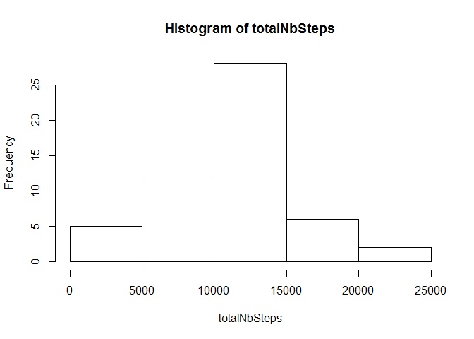
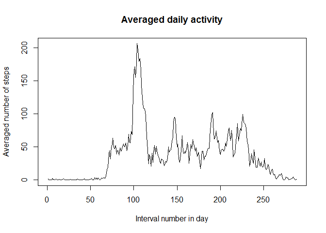
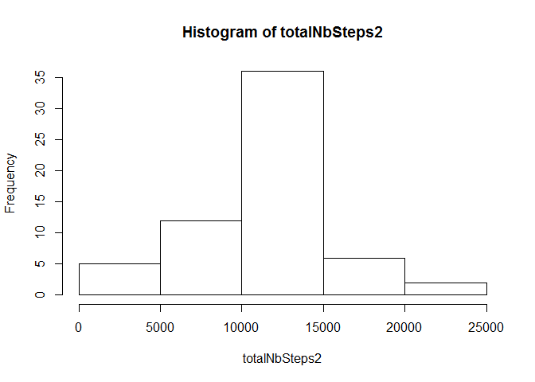
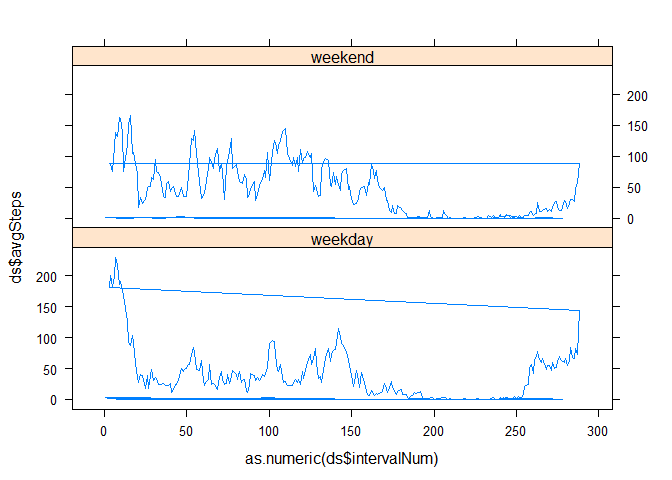

# Reproducible Research: Peer Assessment 1


## Loading and preprocessing the data

```r
library(dplyr)
```

```
## Warning: package 'dplyr' was built under R version 3.1.3
```

```
## 
## Attaching package: 'dplyr'
## 
## The following object is masked from 'package:stats':
## 
##     filter
## 
## The following objects are masked from 'package:base':
## 
##     intersect, setdiff, setequal, union
```

```r
data <- read.csv(unz("./activity.zip", "activity.csv"),  na.strings = c("NA"))
```
Since there are 288 interval of 5 minutes in a day, we identify these intervals just in 1 day

```r
data <- mutate(data, intNumInDay = rep_len(1:288, length(data$interval)))
data <- data[!is.na(data$steps),]
```

## What is mean total number of steps taken per day?
###Total number of steps taken per day

```r
totalNbSteps <- tapply(data$steps, data$date, sum)
```

The total number of steps taken per day is 
NA, 126, 11352, 12116, 13294, 15420, 11015, NA, 12811, 9900, 10304, 17382, 12426, 15098, 10139, 15084, 13452, 10056, 11829, 10395, 8821, 13460, 8918, 8355, 2492, 6778, 10119, 11458, 5018, 9819, 15414, NA, 10600, 10571, NA, 10439, 8334, 12883, 3219, NA, NA, 12608, 10765, 7336, NA, 41, 5441, 14339, 15110, 8841, 4472, 12787, 20427, 21194, 14478, 11834, 11162, 13646, 10183, 7047, NA

###Histogram of the total number of steps taken each day

```r
hist(totalNbSteps)
```

 

###Mean and Median of the total number of steps taken each day

```r
totalNbStepsMean <- mean (totalNbSteps, na.rm = TRUE)
totalNbStepsMedian <- median (totalNbSteps, na.rm = TRUE)
```

The mean of the total number of steps taken each day is 1.0766189\times 10^{4}.
The median of the total number of steps taken each day is 10765.

## What is the average daily activity pattern?
### Plotting the average daily activity

```r
averagedNbSteps <- tapply(data$steps, data$intNumInDay, mean)
plot(averagedNbSteps, xlab = "Interval number in day", ylab = "Averaged number of steps", main = "Averaged daily activity", type = "l")
```

 

###Interval of the day with the max nb of steps

```r
d <- subset(averagedNbSteps, averagedNbSteps == max(averagedNbSteps))
IntWithMaxSteps <- names(d)
```

The interval of the day with the max number of steps is 104.

## Imputing missing values
### total number of rows with NA

```r
completeData <- read.csv(unz("./activity.zip", "activity.csv"),  na.strings = c("NA"))
completeData <- mutate(completeData, intNumInDay = rep_len(1:288, length(completeData$interval)))
dataWithNA <- completeData[!complete.cases(completeData),]
totalNbRowNA <- nrow(dataWithNA)
```

The total number of rows with NA is 2304.

###Filling in missing values with the value of the averaged nb of steps for the interval

```r
fillingValue <- subset(averagedNbSteps, averagedNbSteps == (averagedNbSteps))
dataWithNA <- mutate(dataWithNA, steps = averagedNbSteps[dataWithNA$intNumInDay])
```

###Creation of the new dataset

```r
newDataSet <- rbind(data,dataWithNA)
```

###Re-calculate mean and median and plot the hist of the total nb of steps taken each day with the new dataset
####Total number of steps taken per day

```r
totalNbSteps2 <- tapply(newDataSet$steps, newDataSet$date, sum)
```

In this 2nd part, the total number of steps taken per day is 
1.0766189\times 10^{4}, 126, 1.1352\times 10^{4}, 1.2116\times 10^{4}, 1.3294\times 10^{4}, 1.542\times 10^{4}, 1.1015\times 10^{4}, 1.0766189\times 10^{4}, 1.2811\times 10^{4}, 9900, 1.0304\times 10^{4}, 1.7382\times 10^{4}, 1.2426\times 10^{4}, 1.5098\times 10^{4}, 1.0139\times 10^{4}, 1.5084\times 10^{4}, 1.3452\times 10^{4}, 1.0056\times 10^{4}, 1.1829\times 10^{4}, 1.0395\times 10^{4}, 8821, 1.346\times 10^{4}, 8918, 8355, 2492, 6778, 1.0119\times 10^{4}, 1.1458\times 10^{4}, 5018, 9819, 1.5414\times 10^{4}, 1.0766189\times 10^{4}, 1.06\times 10^{4}, 1.0571\times 10^{4}, 1.0766189\times 10^{4}, 1.0439\times 10^{4}, 8334, 1.2883\times 10^{4}, 3219, 1.0766189\times 10^{4}, 1.0766189\times 10^{4}, 1.2608\times 10^{4}, 1.0765\times 10^{4}, 7336, 1.0766189\times 10^{4}, 41, 5441, 1.4339\times 10^{4}, 1.511\times 10^{4}, 8841, 4472, 1.2787\times 10^{4}, 2.0427\times 10^{4}, 2.1194\times 10^{4}, 1.4478\times 10^{4}, 1.1834\times 10^{4}, 1.1162\times 10^{4}, 1.3646\times 10^{4}, 1.0183\times 10^{4}, 7047, 1.0766189\times 10^{4}

####Histogram of the total number of steps taken each day

```r
hist(totalNbSteps2)
```

 

####Mean and Median of the total number of steps taken each day

```r
totalNbStepsMean2 <- mean (totalNbSteps2)
totalNbStepsMedian2 <- median (totalNbSteps2)
```

In this 2nd part, the mean is 1.0766189\times 10^{4} and the median is 1.0766189\times 10^{4}.

The mean in part1 doesn't differ from the mean in part2
The median in part1 differs from the median in part2
The median in part2 is equal to the mean
Imputing missing values with the average of the number of steps for the interval in the day doesn't greatly impact the estimations


## Are there differences in activity patterns between weekdays and weekends?
###Creating a new factor variable

```r
newdataSet2 <- newDataSet
wd <- c("lundi","mardi","mercredi","jeudi","vendredi")
newDataSet <- mutate(newDataSet, dateType = factor((weekdays(as.Date(newDataSet$date)) %in% wd),labels = c("weekend","weekday")))
```


### Creation of the plot with 2 panels

```r
dataSet1 <- subset(newDataSet, dateType == "weekday")
averagedStepsType1 <- tapply(dataSet1$steps, dataSet1$intNumInDay, mean)
ds1 <- data.frame("intervalNum" <- names(averagedStepsType1), "avgSteps" <- averagedStepsType1)
ds1 <- mutate (ds1, type = "weekday")

dataSet2 <- subset(newDataSet, dateType == "weekend")
averagedStepsType2 <- tapply(dataSet2$steps, dataSet2$intNumInDay, mean)
ds2 <- data.frame("intervalNum" <- names(averagedStepsType2), "avgSteps" <- averagedStepsType2)
ds2 <- mutate (ds2, type = "weekend")

colnames(ds1) <- c("intervalNum", "avgSteps", "type")
colnames(ds2) <- c("intervalNum", "avgSteps", "type")

ds <- rbind(ds1,ds2)

library(lattice)
xyplot(ds$avgSteps ~ as.numeric(ds$intervalNum) | ds$type, layout = c(1, 2), type="l")
```

 

Yes, there are differences in activity patterns between weekdays and weekends.

